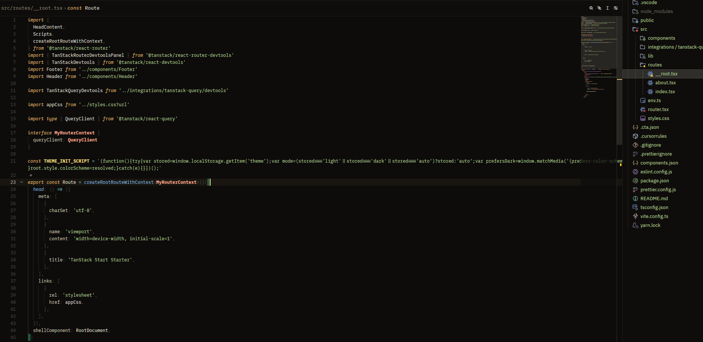
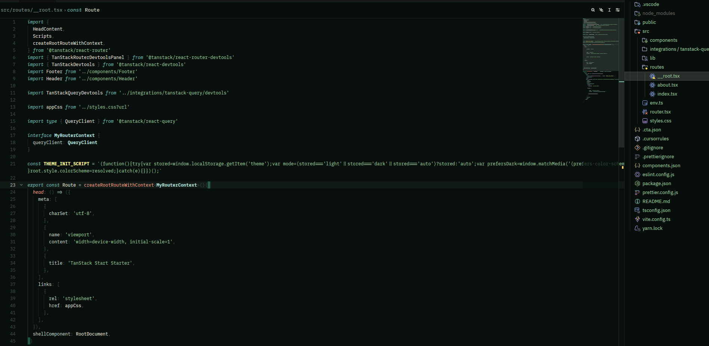
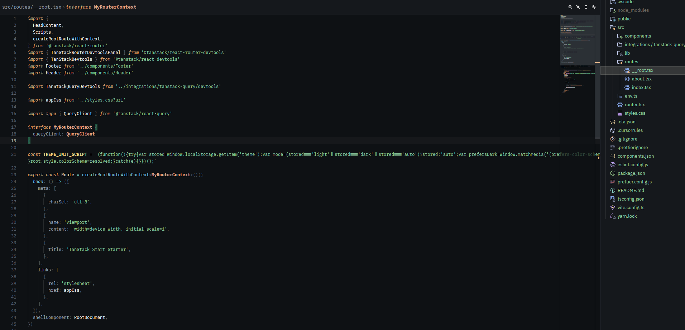
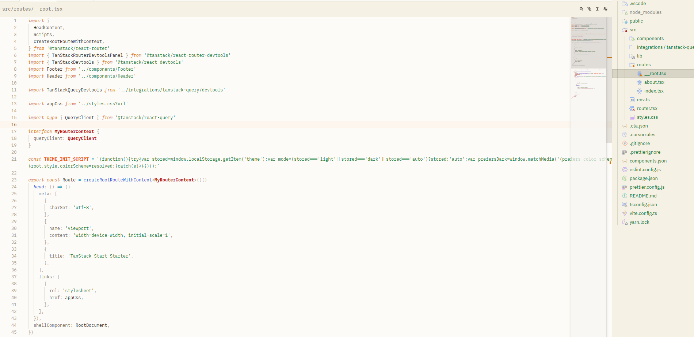

<div align="center">
  
  <h1>🌿 Tofu Zen</h1>
  <p><strong>A Minimalist, Soothing, and High-Contrast Theme Family for Zed IDE.</strong></p>

  <p>
    <a href="https://zed.dev"></a>
    <a href="LICENSE"></a>
    
  </p>
</div>

---

**Tofu Zen** is a theme collection meticulously crafted to provide a focused, clean, and distraction-free coding experience. Inspired by the softness of tofu and the tranquility of Zen philosophy, this theme balances high contrast with a soothing color palette, making it perfect for long-duration coding sessions.

## 🎨 Theme Variants

Tofu Zen comes with four unique variants to suit your workspace mood:

### 1. 🪵 Tofu Zen Wood
The flagship variant featuring warm wood tones and organic visual textures. It provides a grounded yet gentle feel for your eyes.
<p align="center">
  
</p>

### 2. 💎 Tofu Zen Zamrud
A refreshing emerald green theme, designed to enhance focus and mental clarity when handling complex logic.
<p align="center">
  
</p>

### 3. 🌊 Tofu Zen Deep
An elegant and professional deep sea blue variant. This offers the sharpest contrast while maintaining a minimalist aesthetic.
<p align="center">
  
</p>

### 4. 🧈 Tofu Zen Butter (Light)
The only light variant that prioritizes softness. Inspired by the color of butter, it provides a non-glaring glow for well-lit environments.
<p align="center">
  
</p>

---

## ✨ Key Features

- 🌿 **Zen Focus:** A strictly curated color palette designed to significantly reduce eye strain.
- 🎨 **Surgical Syntax:** Intuitive syntax highlighting that helps you distinguish data types, functions, and keywords at a glance.
- 🛠️ **Zed Native:** Fully optimized for Zed's v0.2.0 theme schema, supporting all the latest UI features.
- 👁️ **Enhanced Readability:** Specialized fixes for deprecated text contrast, hover widgets, and diagnostic indicators.

## 🚀 Installation

### Via Zed Extension Manager
1. Open **Zed**.
2. Open the **Command Palette** (`Ctrl+Shift+P` or `Cmd+Shift+P`).
3. Type `zed: extensions` and press **Enter**.
4. Search for **Tofu Zen**.
5. Click **Install**.

## ⚙️ Activation

Once installed, activate your preferred variant:

1. Open the **Command Palette**.
2. Type `theme selector: toggle` (or use the shortcut `Ctrl+K Ctrl+T`).
3. Select one of the variants: `Tofu Zen Wood`, `Tofu Zen Zamrud`, `Tofu Zen Deep`, or `Tofu Zen Butter`.

## 🔧 Recommended Settings

Add the following configuration to your `settings.json` for the best experience:

```json
{
  "theme": "Tofu Zen Wood",
  "ui_font_size": 16,
  "buffer_font_family": "JetBrains Mono",
  "buffer_font_size": 14,
  "theme_overrides": {
    "background.appearance": "opaque"
  }
}
```

## 🤝 Contributing

Want to make Tofu Zen even better? Contributions are highly welcome! Feel free to open an **Issue** or submit a **Pull Request** at our [GitHub repository](https://github.com/farhank15/tofu-zen).

## 📄 License

This project is licensed under the **MIT License**. See the [LICENSE](LICENSE) file for more details.

---
<div align="center">
  Crafted with ❤️ by <a href="https://github.com/farhank15">farhank15</a>
</div>
